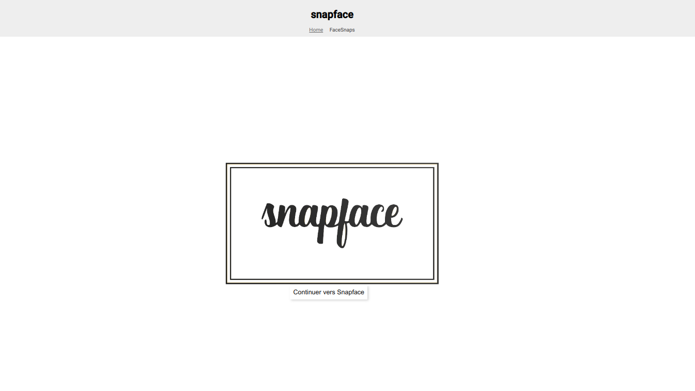

```sh
ng new picShare --style=scss --skip-tests

```

# Good practices : 
## Bad :

```html
  
  ``` 
## Good :
 ```html 
  
  ```  
## Bad :
```ts
export class FaceSnap {
  title: string;
  description: string;
  createdDate: Date;
  snaps: number;
  imageUrl: string;
  
  constructor(title: string, description: string, imageUrl: string, createdDate: Date, snaps: number) {
    this.title = title;
    this.description = description;
    this.imageUrl = imageUrl;
    this.createdDate = createdDate;
    this.snaps = snaps;
  }
}
```
## Good :
  ```ts
  export class FaceSnap {
  constructor(public title: string,
              public description: string,
              public imageUrl: string,
              public createdDate: Date,
              public snaps: number) {
  }
}
  ```


  # Theory :
  ## Directives :

1. Structural Directives :

Structural directives modify the structure of the DOM by adding or removing HTML elements based on certain conditions or values. Structural directives are prefixed with an asterisk (*).
Examples: `*ngIf, *ngFor, *ngSwitch`.

2. Attribute Directives :

Attribute directives modify the appearance or behavior of HTML elements by adding, modifying, or removing attributes or CSS classes.
Examples: `[ngClass], [ngStyle], [ngModel], [ngIf], [ngFor]`.

3. Component Directives:

Component directives allow you to include custom components in a template. They are used to encapsulate the logic and appearance of a part of the application.
Example: `<app-my-component></app-my-component>` (where app-my-component is the component selector).

## Scrolling Methods :
1. ``` this.scroller.scrollToAnchor("targetRed"): ```

Uses ViewportScroller, which may be preferable if you want better control over scrolling in your Angular application.
Suitable for instant scrolling to a specific element without smooth animation.


2. ``` document.getElementById("targetGreen").scrollIntoView({ behavior: "smooth", block: "start", inline: "nearest" }): ```


Uses the standard DOM API, which can be simpler and more straightforward in some cases.
Allows smooth scrolling to the specified element with animation.

3. ``` this.router.navigate([], { fragment: "targetBlue" }): ```

Uses the Angular router to handle scrolling during fragment-based URL navigation.
Useful if you're using URL fragments for navigation and want the router to automatically handle scrolling.

## Observables :

- The `interval()` method generates an Observable that emits increasing numbers.

- The `subscribe()` method allows you to subscribe to an Observable in TypeScript code.

- The `async` pipe subscribes to an Observable to display its emissions in the template.


## Validators : 

# Remarks

```js 
    interval(1000).pipe(
      tap(console.log))
```
is equivalent to :
```js 
    interval(1000).pipe(
      tap(value=>console.log(value)))
```


```html 
  <form>
    <label for="emailInput">Subscribe to receive our newsletter</label>
    <input type="email" id="emailInput" [(ngModel)]="userEmail" name="userEmail">
    <button type="submit" (click)="onSubmitForm()">OK</button>
  </form>
```
is equivalent to :
```html
  <form (ngSubmit="onSubmitForm()")> 
    <label for="emailInput">Subscribe to receive our newsletter</label>
    <input type="email" id="emailInput" [(ngModel)]="userEmail" name="userEmail">
    <button type="submit">OK</button>
  </form>
```

  FormsModule in the imports in app.module.ts creates a directive ngForm in each form created in the app. in the landing-page_component.html we create a local reference to that directive ``` <form #emailForm="ngForm" > ``` . then we could pass that reference the method Onsubmit :
  ```   <form #emailForm="ngForm" (ngSubmit)="onSubmitForm(emailForm)"> ``` 
  which has the following declaration : 
  ``` onSubmitForm(form: NgForm):void { console.log(form.value);} ```
